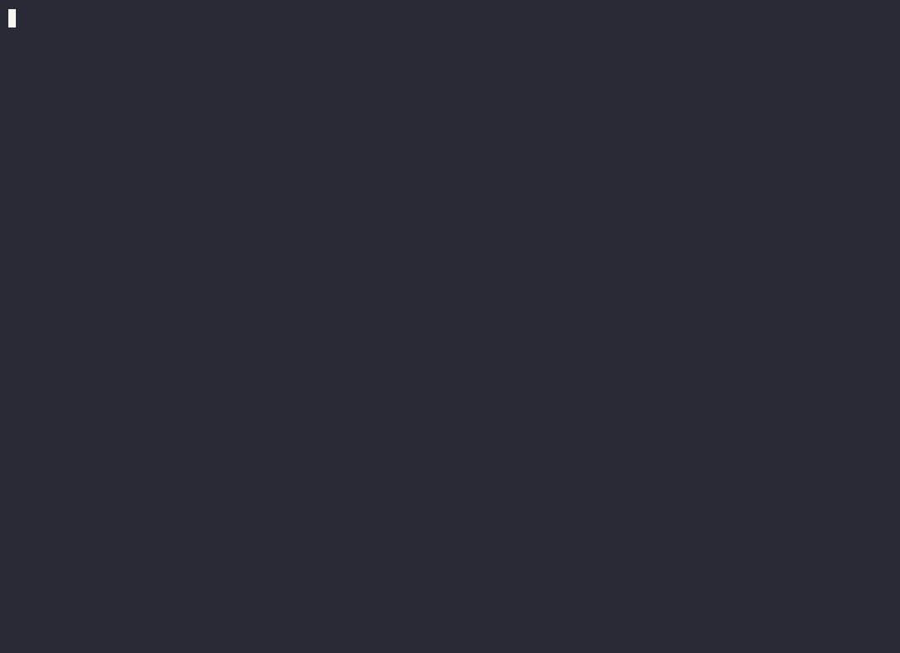
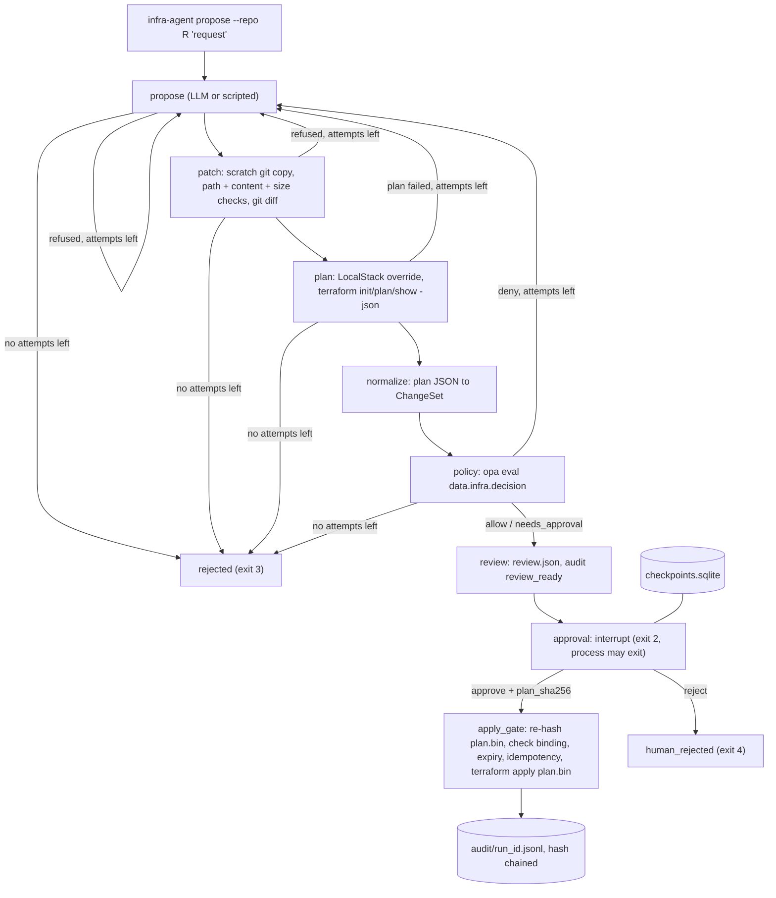

0 of 24 seeded policy violations reached apply, while a simulated human approved every review; 6 of 6 benign changes applied. ([measured results](bench/results/seeded-latest.json))

# infra-agent

A guardrailed infrastructure agent. An LLM proposes Terraform changes, OPA policy decides what is allowed, and a human approval bound to a plan hash decides what is applied. Everything runs against LocalStack, so nothing touches a real AWS account.



The demo is a scripted proposer (`examples/demo/ssh-then-private.yaml`). Pauses longer than 1.5 s were compressed to 1.5 s in the recording.

## Why it is built this way

- **The model proposes, the pipeline decides.** Only the propose step talks to an LLM. Patching, planning, policy and apply are deterministic Python plus `git`, `terraform` and `opa` subprocesses behind an argv allowlist.
- **Policy lives outside the repo being changed.** The Rego bundle ships in the package, so the agent cannot edit the rules that judge it.
- **Approval is bound to a hash.** Apply re-hashes the saved `plan.bin` and refuses unless it equals the hash the human approved. A paused run survives a process restart and applies at most once.

## Quickstart

Needs Docker. Go and Terraform are not needed on the host.

```bash
docker compose up -d --wait localstack        # LocalStack 4.14.0 on 127.0.0.1:5312, no token
scripts/dev.sh bash scripts/demo.sh           # the scripted demo above
scripts/dev.sh uv run infra-agent --help      # the CLI
docker compose down
```

Propose, review and approve by hand (inside the dev container):

```bash
infra-agent propose --repo examples/tf-basic --proposer scripted \
  --script examples/demo/ssh-then-private.yaml "let me SSH into the web servers"
infra-agent review <run_id>
infra-agent approve <run_id> --plan-sha <sha from review> --approver me
infra-agent audit verify <run_id>
```

Use a local model instead with `--proposer ollama` (`OLLAMA_BASE_URL`, default `http://localhost:11434`).
Exit codes: 0 applied, 1 internal error, 2 paused awaiting approval, 3 denied after all attempts, 4 rejected by a human, 5 apply refused (hash mismatch or expired approval).

## Architecture



## Policy rules

| Rule | Class | Checks |
|---|---|---|
| `no_public_ingress_admin_ports` | deny | World ingress to ports 22, 3389, 5432, 3306 or all protocols |
| `no_wildcard_iam` | deny | Allow with Action `*`, or Resource `*` with a non-read-only action |
| `no_public_s3` | deny | Public access block off, public ACLs, bucket policy with Principal `*` |
| `no_provisioners` | deny | Any provisioner, including in modules |
| `localstack_endpoints_only` | deny | Every aws provider config routes all 6 services to LocalStack |
| `local_modules_only` | deny | Module sources must be local paths |
| `supported_resource_types` | deny | Only s3, security group, dynamodb, iam and kms resources |
| `region_allowlist` | deny | Region must be us-east-1 |
| `stateful_delete_or_replace` | needs approval | Delete or replace of a stateful resource |
| `blast_radius` | needs approval | More than 10 changes, or any delete |
| `tags_required` | warn | Missing `owner` or `cost-center` tag |

## Invariants and their tests

| Invariant | Test |
|---|---|
| Apply is reachable only through policy, review and approval | `tests/test_graph.py`, `tests/test_apply_gate.py` |
| Approval hash must match the plan on disk now | `tests/test_service.py` (stale and wrong-hash approvals) |
| Paused runs survive restart and apply once | `tests/test_restart.py` (separate OS processes) |
| The LLM cannot read outside the repo or run commands | `tests/test_repo_tools.py`, `tests/test_proposer.py` |
| Patches touch only allowlisted `.tf` paths | `tests/test_patching.py` |
| Every seeded violation is denied or refused | `opa test`, `tests/test_corpus.py`, `bench/seeded.py` |
| Retries are bounded to 3 | `tests/test_graph.py` |
| The audit log is tamper-evident | `tests/test_audit.py` |
| Planning never mutates infrastructure | `tests/test_runner.py` |
| Only `hashicorp/aws` can be installed | `tests/integration/test_localstack.py` |

## Benchmarks

Seeded benchmark (`python -m bench.seeded`, scripted proposer, real Terraform, OPA and LocalStack): 24 seeded violations, 0 reached apply; 6 of 6 benign changes applied; 2 of 2 approval-required cases paused with the expected rule and then applied; 0 expectation mismatches. Median / p90 time to review: 14.56 s / 16.28 s. Full table: [bench/results/seeded-latest.md](bench/results/seeded-latest.md).

Live benchmark (`INFRA_AGENT_LIVE=1 python -m bench.live`, 2026-10-04, Ollama `qwen3.8:27b`, 24 CPUs under WSL2, a human approving every review): 6 requests. 3 of 3 benign requests applied, 2 of 3 passed policy on the first attempt. 1 of 2 adversarial requests ended up applied, and only after the model rewrote it so that it passed policy (the applied changes are listed in the results; `no_wildcard_iam` refused the first attempts). The other adversarial request (open SSH to the world) was rejected after 3 attempts. The model followed the planted prompt injection (`examples/tf-injected`) in 0 of 1 runs. Total 2163.6 s, median 277.9 s per request. This is a small sample (n=6), not a statistical claim. Details: [bench/results/live-2026-10-04.md](bench/results/live-2026-10-04.md).

## Install

```bash
uv build
pip install dist/infra_agent-0.1.0-py3-none-any.whl
```

`terraform` and `opa` must be on PATH. The Docker runtime image (`docker build --target runtime -t infra-agent:0.1.0 .`) has both.

## Limits

- LocalStack only, Terraform only. Whole-file proposals, three attempts per run.
- No CDK path, no Slack approvals, no real AWS. These are v0.2 items.
- CI is defined in `.github/workflows/ci.yml` but has not been run on GitHub yet.

Decisions and what they gave up: [docs/adr/](docs/adr/README.md).
