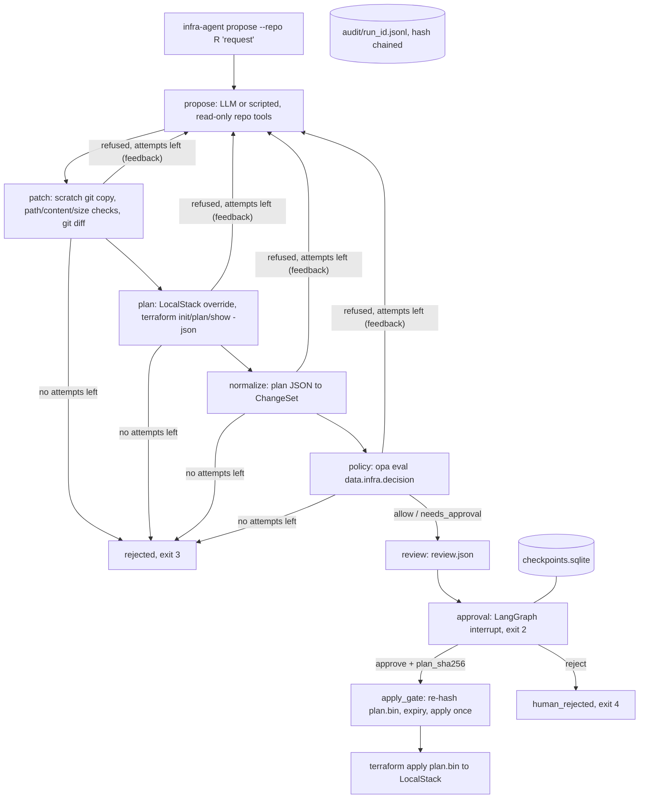

# infra-agent developer guide

## 1. What it is

infra-agent lets an LLM propose Terraform changes but never apply them on its own.
Every proposal goes through checks in a fixed order: patch checks, `terraform plan`, then OPA policy.
A human approves the exact saved plan by its SHA-256. Only then can it be applied.
All applies go to LocalStack. Nothing touches a real AWS account.

**Headline (measured):** 0 of 24 seeded policy violations reached apply, even though a simulated human approved every review. 6 of 6 benign changes applied.
Source: `bench/results/seeded-latest.json` (written by `python -m bench.seeded`).

## 2. Five-minute quickstart

You need Docker. You do not need Terraform, OPA or Python on the host.
Every tool runs in the `dev` container through `scripts/dev.sh`.

```bash
cd infra-agent
docker compose up -d --wait localstack           # LocalStack 4.14.0 on 127.0.0.1:5312, no token
scripts/dev.sh uv sync --frozen                  # first run builds the dev image (a few minutes)
scripts/dev.sh bash scripts/demo.sh              # scripted demo: refused, fixed, approved, applied
docker compose down
```

The demo prints three things in order.
First, attempt 1 is refused by `no_public_ingress_admin_ports`.
Second, attempt 2 is approved and applied.
Third, it prints `audit chain ok`.

To drive the same flow by hand, open a shell with `scripts/dev.sh bash` and run:

```bash
uv run infra-agent propose --repo examples/tf-basic --proposer scripted \
  --script examples/demo/ssh-then-private.yaml "let me SSH into the web servers"   # exit 2: paused
uv run infra-agent review <run_id>                                                  # shows plan_sha256
uv run infra-agent approve <run_id> --plan-sha <plan_sha256> --approver me          # exit 0: applied
uv run infra-agent audit verify <run_id>
```

Use `--proposer ollama` to use a local model instead. It reads `OLLAMA_BASE_URL`.

Exit codes:

| Code | Meaning |
|---|---|
| 0 | applied |
| 1 | internal error, or the run is not in the right state |
| 2 | paused, waiting for approval |
| 3 | denied after all attempts (3 by default) |
| 4 | rejected by a human |
| 5 | apply refused: hash mismatch or expired approval |

## 3. Architecture



How it fits together:

- Only `propose` talks to an LLM. The LLM can only read files in the repo. It returns whole files.
- `patch` refuses paths outside `*.tf`, override files, `backend`, `cloud` and `provisioner` blocks, and oversized changes.
- `plan` writes its own override file. It routes every AWS endpoint to LocalStack and pins local state.
- Terraform can only install `hashicorp/aws`, from an offline mirror baked into the image.
- The Rego policy ships inside the Python package. The agent cannot edit the rules that judge it.
- OPA errors fail closed. A broken or missing decision counts as a refusal.
- `apply_gate.py` is the only code that runs `terraform apply`. It checks that the approved hash, the reviewed hash and the hash of `plan.bin` on disk all match.
- A paused run lives in SQLite. A new process can approve it later, and it applies at most once.
- Every step appends to a hash-chained JSONL audit log. `audit verify` detects edits.

## 4. Project layout

| Path | Purpose |
|---|---|
| `src/infra_agent/proposer.py` | Ollama tool-calling proposer and the scripted proposer |
| `src/infra_agent/repo_tools.py` | Read-only file tools the LLM may call |
| `src/infra_agent/patching.py` | Scratch git copy, path and content checks, diff and patch hash |
| `src/infra_agent/planner.py` | LocalStack override and `terraform init/plan/show` |
| `src/infra_agent/normalizer.py` | Terraform plan JSON to the `ChangeSet` the policy reads |
| `src/infra_agent/policy.py` | `opa eval` wrapper that fails closed |
| `src/infra_agent/policy/` | 11 Rego rules and their `*_test.rego` files |
| `src/infra_agent/graph.py` | LangGraph pipeline, retries, review and approval interrupt |
| `src/infra_agent/apply_gate.py` | The only path to `terraform apply` |
| `src/infra_agent/service.py`, `cli.py` | Run service with SQLite checkpoints, and the CLI |
| `src/infra_agent/runner.py`, `audit.py` | Allowlisted subprocess runner, hash-chained audit log |
| `tests/` | Unit, corpus and restart tests. `tests/integration/` needs LocalStack or Ollama |
| `fixtures/` | Golden plans and the seeded-violation configs |
| `examples/` | Demo repos (`tf-basic`, `tf-injected`) and the demo script |
| `bench/` | `seeded.py` (headline), `live.py` (opt-in LLM run), `results/` |
| `scripts/` | `dev.sh`, `demo.sh`, `record_demo.py`, `policy_coverage.py` |
| `docs/` | Spec, plan, ADRs, demo recording, handoff |

## 5. Run, test, benchmark

All commands run from the repo root.

```bash
# Fast tier: no LocalStack, no LLM
scripts/dev.sh uv run pytest -q -m "not localstack and not live"

# Lint and policy checks
scripts/dev.sh uv run ruff check . && scripts/dev.sh uv run ruff format --check .
scripts/dev.sh opa check --strict src/infra_agent/policy
scripts/dev.sh opa test src/infra_agent/policy -v
scripts/dev.sh uv run python scripts/policy_coverage.py          # every rule has a deny and a pass test

# LocalStack tier: real terraform plan and apply
docker compose up -d --wait localstack
scripts/dev.sh uv run pytest -q                                   # everything except live
scripts/dev.sh uv run python -m bench.seeded                      # headline benchmark, about 15-20 min
docker compose down

# Live tier: needs Ollama on the host (median 278 s per request on CPU)
INFRA_AGENT_LIVE=1 scripts/dev.sh uv run python -m bench.live

# Package and runtime image
scripts/dev.sh uv build
docker build --target runtime -t infra-agent:0.1.0 .
```

Benchmarks write JSON and Markdown to `bench/results/`.
The README numbers must come from those files.

## 6. Key decisions and what they gave up

- [ADR-0001](adr/0001-llm-proposes-whole-files.md): the LLM proposes whole files and git computes the diff. Costs more tokens per attempt.
- [ADR-0002](adr/0002-localstack-community-4-14-no-tflocal.md): LocalStack 4.14.0 with no token, and our own override instead of `tflocal`. Limited to free services.
- [ADR-0003](adr/0003-provider-allowlist-by-filesystem-mirror.md): providers come from an offline mirror. Changing providers means rebuilding the image.
- [ADR-0004](adr/0004-opa-eval-subprocess-policy-in-package.md): `opa eval` as a subprocess, policy inside the package. No OPA decision logs.
- [ADR-0005](adr/0005-hash-bound-approval.md): approval bound to the plan hash, 24 h expiry, apply once. Any changed plan needs a new approval.
- [ADR-0006](adr/0006-langgraph-sqlite-raw-ollama.md): LangGraph with SQLite checkpoints and raw Ollama HTTP calls. No LangChain tooling.
- [ADR-0007](adr/0007-headline-benchmark-and-test-tiers.md): the headline uses a scripted proposer so it is repeatable. It measures the guardrails, not the model. CDK is deferred.

## 7. Known limits and what is left

- Terraform and LocalStack only. No real AWS. Resource types are limited to S3, security groups, DynamoDB, IAM and KMS.
- The live benchmark is small (6 requests, `qwen3.8:27b`). One adversarial request was applied after the model rewrote it into a policy-compliant change. See `bench/results/live-2026-10-04.md`.
- The content checks in `patch` are regexes. The Rego rules and the provider mirror are the real backstop.
- CI is defined in `.github/workflows/ci.yml` but has not run on GitHub yet.
- v0.2: CDK path and Slack approvals.
