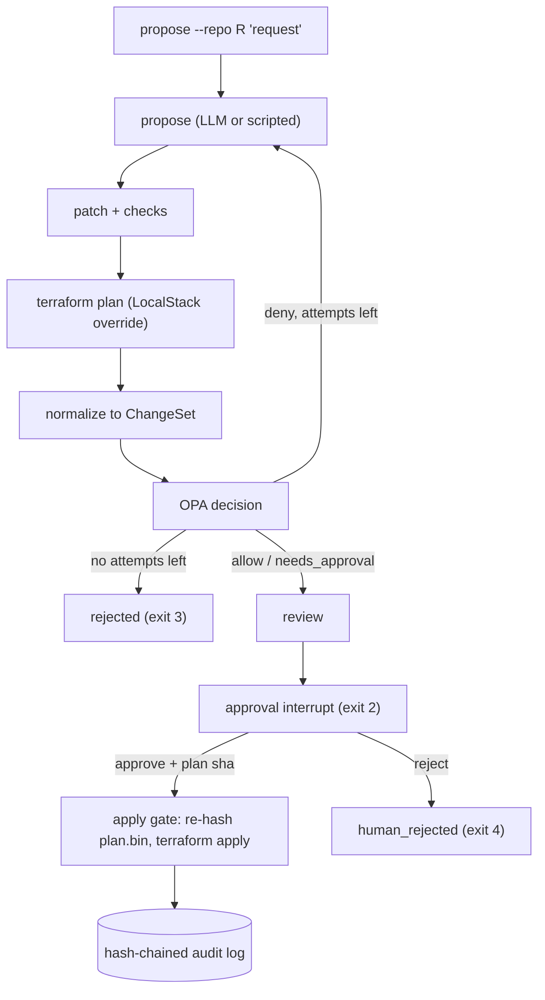

# infra-agent developer guide

## 1. What it is

infra-agent lets an LLM propose Terraform changes without letting it apply them on its own. OPA policy checks every proposal. A human approves the exact plan by its SHA-256. Apply targets LocalStack only.

Headline (measured, `bench/results/seeded-latest.json`): 0 of 24 seeded policy violations reached apply, while a simulated human approved every review; 6 of 6 benign changes applied.

## 2. Five-minute quickstart

Needs Docker only.

```bash
docker compose up -d --wait localstack
scripts/dev.sh bash scripts/demo.sh
scripts/dev.sh uv run pytest -q -m "not localstack and not live"
docker compose down
```

The demo shows attempt 1 refused by `no_public_ingress_admin_ports`, attempt 2 approved and applied, then `audit chain ok`.

## 3. Architecture



Only `propose` talks to an LLM. Everything else is deterministic Python plus `git`, `terraform` and `opa` subprocesses behind one allowlisted `Runner`.

## 4. Project layout

| Path | Purpose |
|---|---|
| `src/infra_agent/` | Pipeline: `proposer`, `patching`, `planner`, `normalizer`, `policy`, `graph`, `apply_gate`, `service`, `audit`, `cli` |
| `src/infra_agent/policy/` | Rego rules and their `*_test.rego` files |
| `tests/` | Unit tests, corpus tests, restart test; `tests/integration/` needs LocalStack |
| `fixtures/`, `examples/` | Golden plans, seeded violations, demo repos |
| `bench/` | `seeded.py` (headline), `live.py` (opt-in LLM run), `results/` |
| `scripts/` | `dev.sh`, `demo.sh`, `record_demo.py`, `policy_coverage.py` |
| `docs/` | Spec, plan, ADRs, demo recording, handoff |

## 5. Run, test, benchmark

```bash
scripts/dev.sh uv run pytest -q -m "not localstack and not live"   # default tier
docker compose up -d --wait localstack
scripts/dev.sh uv run pytest -q -m localstack                       # real terraform on LocalStack
scripts/dev.sh uv run python -m bench.seeded                        # headline benchmark
INFRA_AGENT_LIVE=1 scripts/dev.sh uv run python -m bench.live       # needs Ollama on the host
scripts/dev.sh opa test src/infra_agent/policy -v
scripts/dev.sh uv run python scripts/policy_coverage.py
scripts/dev.sh uv run ruff check .
```

## 6. Key decisions and what they gave up

- [ADR-0001](adr/0001-llm-proposes-whole-files.md): whole-file proposals. Costs more tokens per attempt.
- [ADR-0002](adr/0002-localstack-community-4-14-no-tflocal.md): LocalStack 4.14.0 without a token. Limited to the free services.
- [ADR-0003](adr/0003-provider-allowlist-by-filesystem-mirror.md): offline provider mirror. The image must be rebuilt to change providers.
- [ADR-0004](adr/0004-opa-eval-subprocess-policy-in-package.md): `opa eval` subprocess. No decision logs.
- [ADR-0005](adr/0005-hash-bound-approval.md): hash-bound approval with expiry. A changed plan needs a new approval.
- [ADR-0006](adr/0006-langgraph-sqlite-raw-ollama.md): LangGraph with SQLite and raw Ollama calls. No LangChain tooling.
- [ADR-0007](adr/0007-headline-benchmark-and-test-tiers.md): scripted headline benchmark and three test tiers. CDK deferred.

## 7. Known limits and what is left

- LocalStack and Terraform only. No real AWS.
- Live-model results (6 requests, qwen3.8:27b) depend on the local model and hardware, and are a small sample (see the README).
- CI is defined but has not run on GitHub.
- v0.2: CDK path, Slack approvals.
