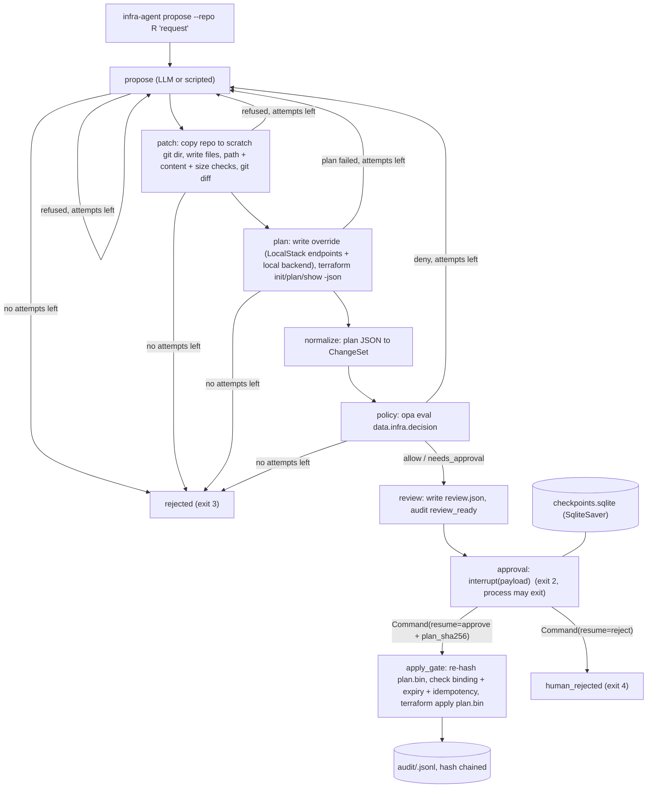

# infra-agent v0.1 spec (2026-10-04)

Source design: `C:\Users\sathwik\projects\taskarinchu\docs\devdocs\infra-agent.md`. This spec narrows it to what v0.1 ships. Where the two disagree, this spec wins and the ADRs explain why.

## One-line pitch

An LLM proposes a Terraform change. A deterministic pipeline (git diff, `terraform plan`, OPA policy, a human approval bound to the SHA-256 of the exact plan file) decides whether it is applied. v0.1 applies to LocalStack only.

## Headline number (README line 1)

"**0 of N seeded policy violations reached apply**", where N is the size of the seeded corpus in `evals/seeded/`. It is measured by `bench/seeded.py` with real `terraform plan`, real OPA and a real LocalStack, while the simulated human approves **every** review it is shown. Next to it, the README reports "M of M benign changes applied" from the same run, so the 0 cannot come from denying everything. Every number is copied from `bench/results/seeded-latest.json`. Nothing is estimated.

## What v0.1 ships

1. A Python package `infra-agent` (wheel built by `uv build`, console script `infra-agent`) with its Rego policy bundle inside the package.
2. A Docker image (`Dockerfile`) with Python 3.12, uv, git, Terraform 1.16.5, OPA 1.21.1 and an offline provider mirror that holds only `hashicorp/aws` 6.67.0.
3. `docker-compose.yml` with LocalStack Community 4.14.0 (no auth token) and the `dev` service that runs every command.
4. The CLI: `propose`, `review`, `approve`, `reject`, `audit verify`, `policy test`.
5. 11 Rego rules, each with an allow and a deny test, plus a coverage script.
6. A seeded corpus with a benchmark that produces the headline. There is also an opt-in live LLM benchmark (Ollama `qwen3.8:27b`).
7. CI (GitHub Actions), a README with a GIF made from a real run, ADRs, DEVDOCS and a handoff.

## Not in v0.1 (moved to v0.2 or later)

- The CDK path (`cdk synth` and template diff). The design listed it as v0.2 and it stays there. See ADR-0007.
- Slack approvals, auto-apply for `allow`, two approvers, cost guards, drift detection.
- `encryption_required` and a check that every bucket has a public access block. v0.1 denies explicit public ACLs, public bucket policies and access blocks with a flag set to false. A bucket with no access block only gets a warning. See "Policy set".
- Any real AWS endpoint. This is unreachable by construction (ADR-0002, ADR-0003).

## Architecture



Only `propose` talks to an LLM. Everything after it is deterministic Python plus `git`, `terraform` and `opa` subprocesses. All of those subprocesses go through one `Runner` that enforces an argv allowlist.

## Components

| Module (`src/infra_agent/`) | Responsibility |
|---|---|
| `config.py` | `Settings.from_env()`: home dir, LocalStack URL, Ollama URL and model, attempt and size limits, approval TTL, binaries. |
| `hashing.py` | `sha256_bytes`, `sha256_file`, `sha256_tree` (policy bundle hash). |
| `runner.py` | `Runner` protocol, `SubprocessRunner`, `RecordingRunner`, `FakeRunner`, and `check_argv` (invariant 10). |
| `repo_tools.py` | `RepoTools.list_files` and `read_file`, limited to the repo root (invariant 4). `TOOL_NAMES`. |
| `patching.py` | `prepare_workdir`, `apply_changes`: path allowlist, forbidden content, line cap, git diff, patch hash (invariant 5). |
| `planner.py` | `render_override`, `TerraformPlanner`, `FakePlanner`. |
| `normalizer.py` | `normalize_terraform(plan_json, ...)` returns a ChangeSet. |
| `policy/` (package data) | Rego: `decision.rego`, `config.rego`, one file per rule, and `*_test.rego`. |
| `policy.py` | `OpaPolicy.evaluate(changeset, context)` and `bundle_sha256`. Fails closed. |
| `audit.py` | `AuditLog.append`, `AuditLog.events`, `verify_log` (invariant 9). |
| `proposer.py` | `Proposer` protocol, `ScriptedProposer`, `OllamaProposer` (3 tools: `list_files`, `read_file`, `submit_change`). |
| `graph.py` | `RunState`, `Deps`, `build_graph(deps, checkpointer)`. |
| `apply_gate.py` | `run_apply_gate(state, ...)`: hash binding, expiry, idempotency, apply. |
| `service.py` | `Service`: `propose`, `review`, `approve`, `reject`, `status`. Owns the SQLite checkpointer. |
| `cli.py` | `main(argv) -> int`. |

## Data shapes

### FileChange (proposer output)
`{"path": "network.tf", "content": "<full new file text>" | null}`. `null` deletes the file. The LLM sends whole files, not diffs. The diff is computed by `git diff --cached` in the scratch dir (ADR-0001).

### ChangeSet (OPA input under `input.changeset`)

```json
{
  "tool": "terraform",
  "plan_sha256": "…", "base_commit": "…", "patch_sha256": "…",
  "changes": [{"address": "aws_security_group.web", "type": "aws_security_group", "module_address": null,
               "actions": ["create"], "replace": false, "before": null, "after": {…}, "after_unknown": {…}}],
  "stats": {"create": 1, "update": 0, "delete": 0, "replace": 0},
  "providers": [{"key": "aws", "name": "aws", "alias": null, "region": "us-east-1", "endpoints": {"s3": "http://localstack:4566", …}}],
  "provisioners": [{"address": "aws_s3_bucket.x", "type": "local-exec"}],
  "module_calls": [{"address": "module.net", "source": "./modules/net"}]
}
```

`changes` leaves out the `no-op` and `read` actions. `replace` is true when the actions are `["delete","create"]` or `["create","delete"]`. A replace counts in `stats.replace` only, not in `create` or `delete`.

### OPA input and output

The input is `{"changeset": ChangeSet, "context": {"localstack_url": "<Settings.localstack_url>"}}`. The query is `data.infra.decision`:

```json
{"decision": "deny", "deny": [{"rule": "no_public_ingress_admin_ports", "address": "…", "msg": "…"}],
 "needs_approval": [], "warn": []}
```

Python adds `policy_bundle_sha256`. Precedence: any deny gives `deny`, else any needs_approval gives `needs_approval`, else `allow`. If there is no result, a non-zero exit or an unknown decision string, `PolicyError` is raised and the run fails closed (it counts as a refused attempt).

### Approval resume value (validated by pydantic `ApprovalDecision`)
`{"decision": "approve"|"reject", "plan_sha256": "<64 hex>" (required for approve), "approver": "…", "reason": "…", "at": "<iso8601>"}`

### Audit line (`<home>/audit/<run_id>.jsonl`)
`{"seq": 0, "run_id": "…", "event": "run_started", "at": "…", "prev_sha256": "000…0", …event fields}`. Lines are compact JSON with sorted keys. `prev_sha256` is the SHA-256 of the previous line's exact bytes, without the newline. Events: `run_started`, `proposal`, `attempt_refused`, `review_ready`, `approved`, `human_rejected`, `run_rejected`, `apply_refused_hash_mismatch`, `apply_refused_expired`, `apply_refused_no_decision`, `applied`, `apply_failed`.

## Run directory layout (`INFRA_AGENT_HOME`, default `./.infra-agent`)

```
checkpoints.sqlite
audit/<run_id>.jsonl
state/<repo-slug>.tfstate                      # local backend, one per target repo
runs/<run_id>/attempt-<n>/work/                # scratch git copy of the repo + override file
runs/<run_id>/attempt-<n>/plan.bin, plan.json, changeset.json, decision.json
runs/<run_id>/review.json
runs/<run_id>/applied.json                     # idempotency marker
```

## Policy set (v0.1)

| Rule | Class | Checks |
|---|---|---|
| `no_public_ingress_admin_ports` | deny | Ingress from `0.0.0.0/0` or `::/0` covering ports 22, 3389, 5432 or 3306, or using protocol `-1`. Covers `aws_security_group` inline ingress, `aws_security_group_rule` (type ingress) and `aws_vpc_security_group_ingress_rule`. |
| `no_wildcard_iam` | deny | An Allow statement in `aws_iam_policy`, `aws_iam_role_policy`, `aws_iam_user_policy` or `aws_iam_group_policy` with Action `*`, or with Resource `*` and an action that is not read-only (`Get*`, `List*`, `Describe*`). |
| `no_public_s3` | deny | A public access block with any of the 4 flags false, an `aws_s3_bucket_acl` that is public-read, public-read-write or authenticated-read, or a bucket policy that allows Principal `*`. |
| `no_provisioners` | deny | Any provisioner anywhere in the configuration, including modules. `local-exec` runs commands at apply time. |
| `localstack_endpoints_only` | deny | Every `aws` provider config (aliases too) must set all 6 service endpoints (s3, ec2, dynamodb, iam, sts, kms) to `input.context.localstack_url`. |
| `local_modules_only` | deny | Module sources must start with `./` or `../`. |
| `supported_resource_types` | deny | Created or updated resource types must start with one of `aws_s3_`, `aws_security_group`, `aws_vpc_security_group_`, `aws_dynamodb_`, `aws_iam_` or `aws_kms_`, which are the services routed to LocalStack in v0.1. |
| `region_allowlist` | deny | The provider region and any per-resource `region` attribute (AWS provider 6.x) must be in `["us-east-1"]`. |
| `stateful_delete_or_replace` | needs_approval | Delete or replace of `aws_dynamodb_table`, `aws_s3_bucket`, `aws_db_instance`, `aws_rds_cluster` or `aws_kms_key`. |
| `blast_radius` | needs_approval | More than 10 changes, or any delete. |
| `tags_required` | warn | A create or update of a resource with a `tags` attribute that lacks `owner` or `cost-center`. |

## Invariants and the tests that prove them

| # | Invariant | Test |
|---|---|---|
| 1 | No path reaches `apply_gate` except through `policy`, then `review`, then `approval`. | `tests/test_graph.py::test_apply_gate_only_reachable_through_policy_and_approval` (inspects compiled graph edges). `tests/test_apply_gate.py::test_refuses_without_allow_decision`. |
| 2 | Apply needs an approval whose `plan_sha256` equals both the hash recorded at review and the hash of `plan.bin` on disk right now. | `tests/test_service.py::test_stale_approval_refused` (tamper with plan.bin after the interrupt, exit 5, zero apply calls). `test_wrong_hash_in_approval_refused`. |
| 3 | A paused run survives a process restart and is applied at most once. | `tests/test_restart.py::test_resume_after_restart_applies_once` (separate OS processes). |
| 4 | The LLM cannot read outside the repo or run commands. | `tests/test_repo_tools.py` (`..`, absolute, drive letter, symlink escape, size cap). `tests/test_proposer.py::test_tool_registry_closed`. |
| 5 | Patches touch only allowlisted `.tf` paths, never override files, never `provisioner` or `backend` blocks, and at most `max_changed_lines`. | `tests/test_patching.py`. |
| 6 | Every seeded violation is denied or refused. | `opa test` (allow and deny per rule). `tests/test_corpus.py::test_seeded_violation_fixtures_denied` (normalizer + OPA over golden plans). `bench/seeded.py` end to end. |
| 7 | The agent cannot weaken policy. | The policy lives in the package, outside every target repo. `tests/test_service.py::test_policy_bundle_hash_unchanged_by_run`, and patch tests for `../` paths. |
| 8 | Retries are bounded. | `tests/test_graph.py::test_max_attempts_exactly_three_policy_evals`. |
| 9 | The audit log is tamper-evident. | `tests/test_audit.py::test_tamper_detected_names_first_bad_seq`. |
| 10 | Planning never mutates infrastructure. Only the apply gate may run `terraform apply`, and only on a saved plan file. | `tests/test_runner.py`. |
| 11 | Only the `hashicorp/aws` provider can be installed. | The Docker filesystem mirror. `tests/integration/test_localstack.py::test_non_allowlisted_provider_fails_init`. |

## Exit codes

`0` applied (or already applied), `1` internal error, `2` paused awaiting approval, `3` denied or refused after all attempts, `4` rejected by a human, `5` apply refused (hash mismatch or expired approval).

## Test tiers

- **default** (`uv run pytest`): pure Python plus real `opa` and `git` inside the dev image. No network, no LocalStack, no Ollama.
- **`localstack`** marker: needs `INFRA_AGENT_LOCALSTACK_URL`. It skips cleanly with a reason when the variable is unset. It runs real `terraform` against LocalStack.
- **`live`** marker: needs `INFRA_AGENT_LIVE=1` and Ollama. It skips cleanly otherwise.

## Environment facts verified while planning (2026-10-04)

- `localstack/localstack:4.14.0` (build date 2026-02-26) starts **without** an auth token. Terraform with AWS provider 6.67.0 planned and applied an S3 bucket, a security group, a DynamoDB table with PITR, and an IAM policy against it.
- With a filesystem mirror plus a `plugin_cache_dir` filled while the image is built, `terraform init` works offline. Each container needs about 8 s for init and 4.5 s for the plan of 5 resources, and the apply took about 20 s. The plugin cache **must** be filled at image build time. A cache made in one container leaves dangling symlinks in the next one.
- `terraform show -json plan.bin` is byte-stable for the same plan.bin. `plan.json` has `format_version` 1.2, `configuration.provider_config.aws.expressions.endpoints[0].<svc>.constant_value`, and `configuration.root_module.resources[].provisioners[].type`. Resources have a per-resource `region` attribute in provider 6.x.
- A `local-exec` provisioner ran `echo hi` during apply. That is why `no_provisioners` exists.
- OPA 1.21.1 accepts Rego v1 syntax. `opa eval --format json` returns `result[0].expressions[0].value`. `opa fmt -w` adds a trailing blank line, so the gate is `opa fmt --list --fail`.
- LangGraph 1.2.12 with `langgraph-checkpoint-sqlite` 3.1.1: `interrupt()` pauses, a new OS process resumes with `Command(resume=…)`, and resuming a finished thread runs no node again. `compiled.get_graph().edges` lists conditional edges.
- Ollama `qwen3.8:27b` `/api/chat` with `tools` and `"think": false` returned well-formed `tool_calls` (arguments arrive as a JSON object). One turn took about 50 s with a warm model on the shared GPU.
- `ghcr.io/asciinema/agg:1.9.0` renders an asciicast v2 file to a GIF.
